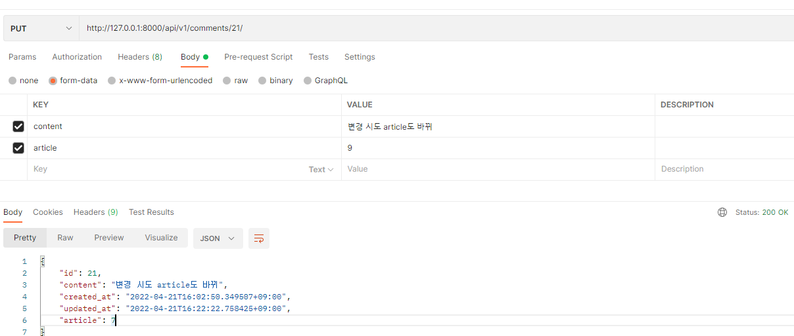

# RESTful API

## HTTP


- 웹 상에서 컨텐츠를 전송하기 위한 약속
- 웹에서 이루어지는 모든 데이터 교환의 기초
  - Request
    - 클라이언트에 의해 전송되는 메시지
  - Response
    - 서버에사 응답으로 전송되는 메시지

**기본특성**

- Stateless

  - stateful은 서버가 클라이언트의 이전 상태를 보존한다는 의미이고 stateless는 서버가 클라이언트의 이전 상태를 보존하지 않는다는 의미이다. 따라서 클라이언트의 요청이 대폭 증가해도 서버를 증설해 해결할 수 있다. 하지만 모든 것을 stateless로 설계할 수 없다. 단순히 로그인만 보더라도 사용자가 로그인한 상태를 서버에 유지시켜 주어야 한다. 이 경우에는 브라우저 쿠키나 서버 세션 등을 사용해 상태를 유지한다.

- Connectionless

  - 비연결성은 클라이언트가 서버에 요청을 하고 응답을 받으면 바로 TCP/IP 연결을 끊어 연결을 유지 하지 않는 것이다. 이를 통해 서버의 자원을 효율적으로 관리하고, 수 많은 클라이언트의 요청에도 대응할 수 있게 한다. HTTP는 연결을 유지하지 않는 모델을 기본으로 한다. 수 천명이 서비스를 사용해도 실제 서버에서 `동시에 처리하는 요청`은 수 십개 이하로 작다(예를 들어 구글을 수 천명이 이용해도 검색을 수 천명이 동시에 이용하지는 않는다. 하지만 현대카드 슈퍼콘서트 예매처럼 정말 수 십만명이 한꺼번에 몰리는 경우도 있다😂).

  - **한계**

    - 연결이 끊어짐에 따라 새로 연결될 때 TCP/IP 연결을 새로 맺어야 하므로 3-way handshake에 따른 시간이 추가된다.

    - HTML 뿐만 아니라 자바스크립트, CSS, 이미지 등 수 많은 자원이 함께 다운로드된다(HTML을 받기 위해 연결하고 종료, 자바스크립트 파일을 받기 위해 연결하고 종료...).

  - **해결**

    - 현재는 HTTP 지속 연결(Persisten Connections)로 문제를 해결했다. 지속 연결은 요청에 따라 연결이 된 이후 일정 시간 연결을 유지하거나 여러 개의 요청(HTML, 자바스크립트, 이미지 등)에 대한 응답이 다 올 때 까지 기다린 후 연결을 종료하는 것이다(더 자세히 알아봐야겠다🧐). HTTP/2, HTTP/3에서는 최적화를 이루었다.

[Stateless, Connectionless 설명 출처](https://velog.io/@duarufp06/HTTP-Stateless-Connectionless-HTTP-%EB%A9%94%EC%8B%9C%EC%A7%80-%EA%B0%9C%EB%85%90)

DRF => API 서버

클라이언트 ->요청->서버

서버 <- 응답 <- 클라이언트, 응답 할 떄는 JSON으로, 응답할떄 중요한건(status code)


REST API

- 자원 - resource : URL
- 행위 - method : HTTP method
- 표현 - reprsentation : JSON


Read - GET /movies/1/

Update - PUT 영화정보 리소스

Delete - DELETE

Create -POST


## QnA

- 직렬화가 무슨 의미인지 모호합니다.

  - The process whereby an object or data structure is translated into a format suitable for transferral over a network, or storage (e.g. in an array buffer or file format).
  - **django modelserializer는 파이썬 article, user 혹은 queryset의 객체를 ⇒ JSON으로 변환해주는 것!**

- 그래서 REST API가 지금까지 저희가 배운 django보다 성능이 좋아서 배운느건가요?

  - **구조적인 아키텍처 설계의 변화**

- AppSerializer랑 AppListSerializer랑 쓰임새가 어떻게 다른지 알고 싶습니다.

  - ModelForm

    - HTML을 표현
    - 객체로 저장

  - Serializer

    - JSON을 표현
    - 객체로 저장

  - Article.objects.all() ⇒ QuerySet (article 객체로 이뤄진)

    ```json
    [
    	{ 
    		"id": 1,
    		"title": "제목",
    		"content": "내용"
    	},
    	{ 
    		"id": 2,
    		"title": "제목",
    		"content": "내용"
    	}
    ]
    ```

  - Article.objects.get(pk=pk) ⇒ article 객체

    ```json
    { 
    	"id": 1,
    	"title": "제목",
    	"content": "내용"
    }
    ```


1. api_view 왜 데코레이터를 다른거 쓰나요 (require_http_method 왜 이거 안쓰고?) ---> 혹시 다른 class에 관련된 것이기 때문인가요 **(http_method --> views.decorator.http 안에 있고 / api_view ---> rest_framework 안에 있어서 ?)** 그러면 앞으로 백/프론트 구분해서 개발할 거고 templates 안쓴다 그러면 이제 views.decorator.htttp 는 이별해도 되나요

2. 왜 처음부터 올바른 응답코드를 보여주지 않고 status 를 import 해서 보여줘야 하는지

   - 왜 수정됨에 대한 상태 코드는 없지만 생성됨 삭제됨에 대한 상태 코드는 존재하는걸까요?

   **204 No content**

   - 요청한 것은 성고, 근데 줄 정보가 없다.

   **수정**

   - 수정 -> 수정된 결과를 JSON으로 주지 않는다면 그때 204를 써도된다.
   - 수정된 결과를 JSON으로 준다 => 200

   ```json
   
   {
   	'id' : 1,
       'title' : '제목',
       'content' : '내용',
       
   }
   ```

   

3. method == 'DELETE' 인 경우 보여지기 위해서 data 를 딕셔너리로 입력 후 Response 에 넣었기 때문에 필수가 아니라고 생각했어요 만약 DELETE 시 data 안보여주겠다 하면 Response에 첫번째로 data 넣지 않아도 정상 동작 하겠죠?

4. is_valid() 옵션에 raise_exception 에 대해서 한 번 더.....(그리고 왜 기존에는 사용하지 않아도 됐는지)


**model 에서 foreignkeyfield  하면 그 때 참조되는 모델에서  참조하는모델_set  이라는 역참조 가 생기는거죠?**


## drf - comment

**comment_create**

```python
@api_view(['POST'])
def comment_create(request, article_pk):
    article = get_object_or_404(Article, pk=article_pk)
    serializer = CommentSerializer(data=request.data)
    if serializer.is_valid(raise_exception=True):
        serializer.save(article=article) # article=article안해도 되네
        return Response(serializer.data, status=status.HTTP_201_CREATED)
```

`serializer.save(article=article)`이부분은 `Read Only Field`설정하기 전에는 `serializer.save()`이렇게 비어도 됐었는데 `Read Only Field`설정 추가하니까 아래 오류 떴다.


그래서 `serializer.save(article=article)`하고 실행시키니까 됐다.

**comment_delete**, **수정**

```python
@api_view(['GET', 'DELETE', 'PUT'])
def comment_detail(request, comment_pk):
    comment = get_object_or_404(Comment, pk=comment_pk)
    
    if request.method == 'GET':
        serializer = CommentSerializer(comment)
        return Response(serializer.data)
    
    elif request.method == 'DELETE':
        comment.delete()
        data = {
            'delete' : f'댓글 {comment_pk}번이 삭제됐습니다.'
        }
        return Response(data, status=status.HTTP_204_NO_CONTENT)
    
    elif request.method == 'PUT':
        serializer = CommentSerializer(comment, data=request.data)
        if serializer.is_valid(raise_exception=True):
            serializer.save()
            return Response(serializer.data)
```



`article `변경도 시도했으나 `Read Only Field`를 설정해서 안되는 것 같다.