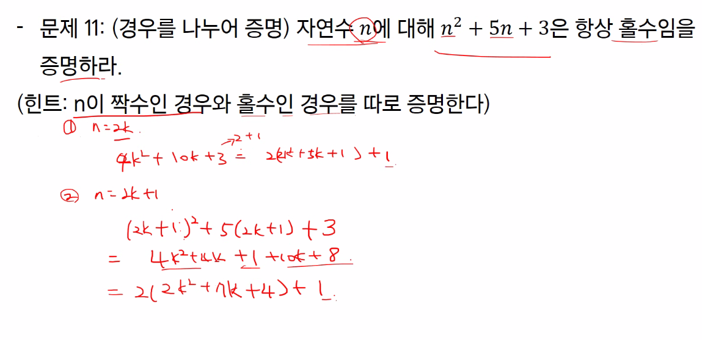
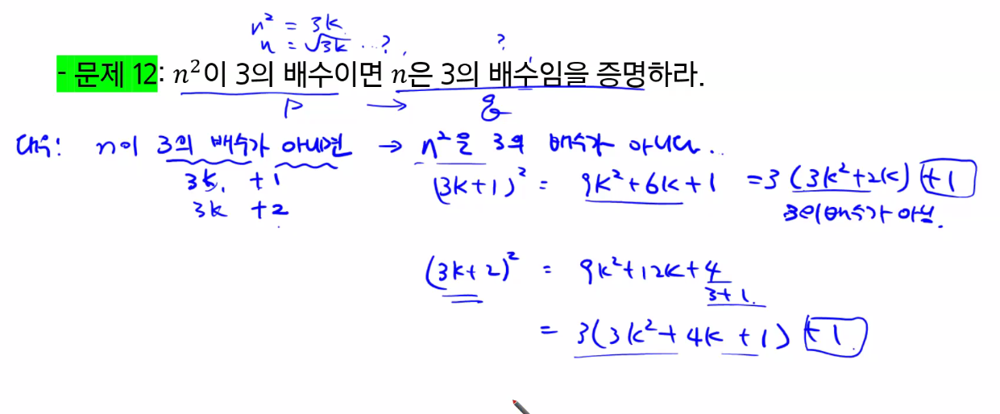
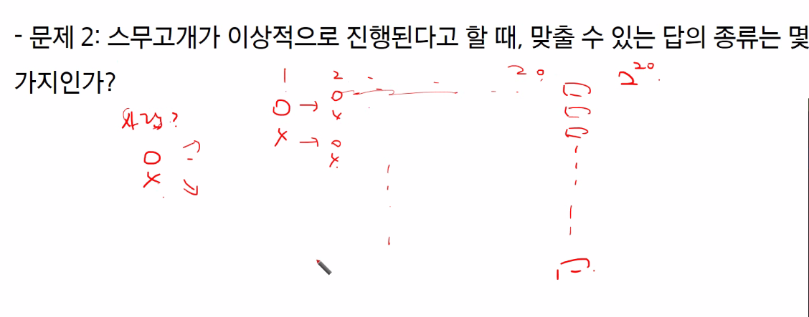
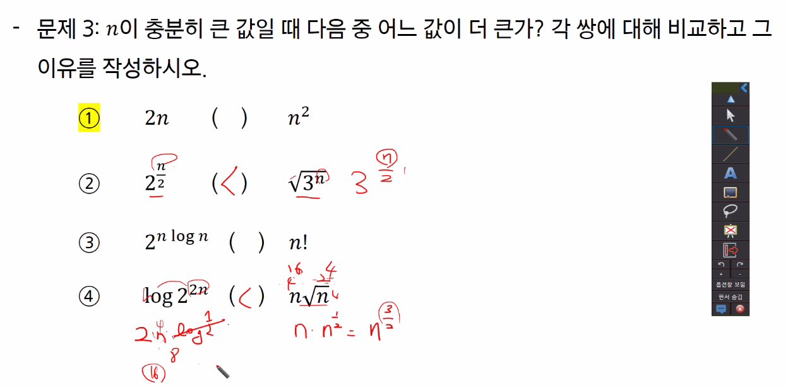
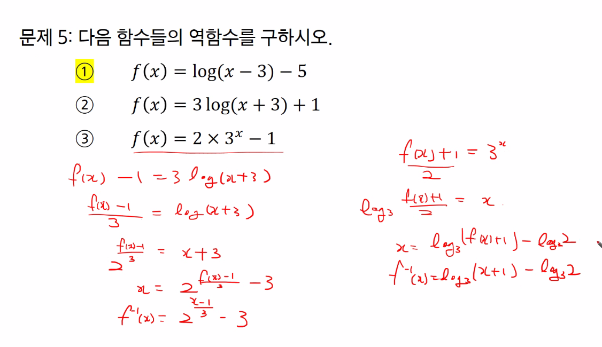
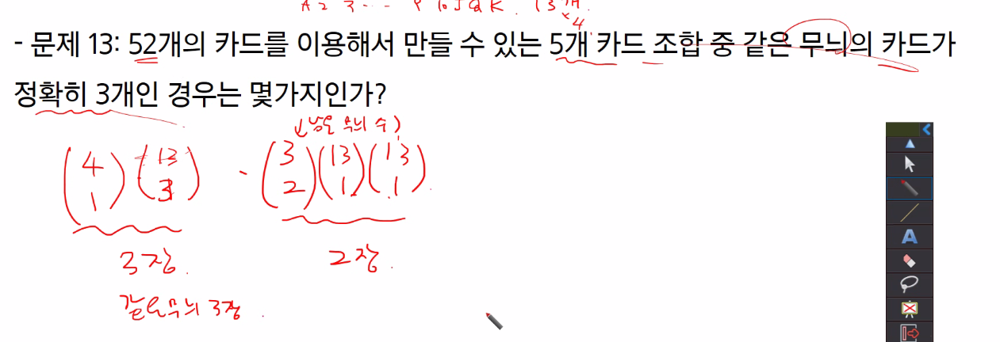
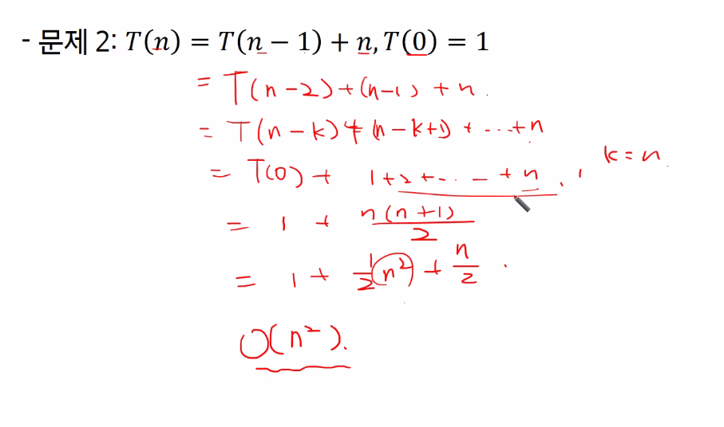
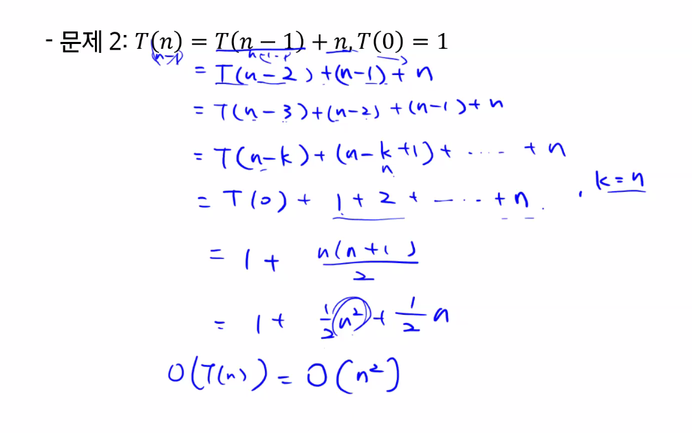
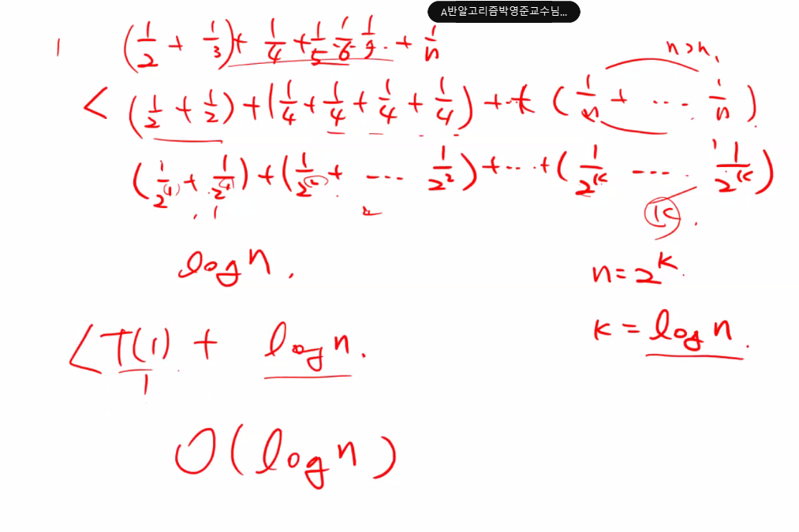

# 컴퓨팅 사고력

일상 생활에서는 Soft Logic 유용

프로그래밍은 Hard Logic 


Soft Logic으로 알고리즘을 이해하려 하면 힘듦


명제 참이나 거짓을 알 수 있는 식이나 문장.


## 1. 논리와 증명

> 문제 8: m이 짝수이고 n이 홀수이면 2m + 3n은 홀수임을 증명

2k = m, 2h +1 = n

 2 * 2K + 3 * (2h + 1)

> 문제 9
>
> 

> 문제 10: n**2이 짝수이면 n은 짝수임을 증명하라

> 문제 11
>
> 

> 문제 12
>
> 

## 2. 수와 표현

> 문제 2
>
> 

> 문제 3
>
> 

> 문제 4 과제

> 문제 5
>
> 

## 3. 집합과 조합론

> 문제 2
>
> 

> 문제 4: 귀류법을 이용하여 (A - B) 교집합 (B - A) = 공집합을 증명하라

귀류법란 현 명제가 참인것을 증명 -> 명제의 부정을 참이라 가정...모순을 증명해서 원래의 명제가 참임을 보임

> 문제 8:

> 문제 10
>
> 

> 문제 12:
>
> 

> 문제 13
>
> 
>
> 답 : 580008

> 믄제 14
>
> ```
> xyz가 0이면 안되니까 x-1 y-1 z-1 을 각각 ABC라 한다면 A+B+C=97이고 ABC>=0이므로 3H97입니다. 그러므로 99C2구요 99*49이고 4851입니다
> ```
>
> ```
> 자연수니까 x y z 라는 3개의 통 각각에 적어도 1이상은 있어야해서 1개씩 넣으면 97개 남으니까 3개의 통에 97개 중복해서 넣어도 된다 = 3H97 = 99C97 = 99C2
> ```

## 4. 기초수식

> 문제 1:


> 문제 2
>
> 
>
> 

> 문재 3
>
> 

> 문제 4
>
> 

> 문제 5
>
> 

> 문제 7
>
> 

뭔가 풀어줌



## 5. 재귀

월말평가 서술형 나올 수도 있음

> 문제 1
>
> 

## 6. 동적 프로그래밍

메모리케이션